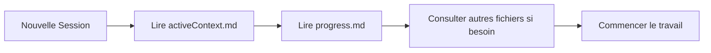

# Memory Bank - Guide d'utilisation

## 🧠 Qu'est-ce que la Memory Bank ?

La Memory Bank est un système de documentation persistante conçu pour maintenir la continuité du projet Valorix entre les sessions. Comme ma mémoire est réinitialisée à chaque nouvelle conversation, ces fichiers sont **essentiels** pour comprendre le contexte et poursuivre le travail efficacement.

## 📁 Structure des fichiers

### Fichiers essentiels (obligatoires)

1. **`projectbrief.md`** - Document fondateur
   - Définit les objectifs et contraintes du projet
   - Source de vérité pour le scope
   - Ne jamais modifier sans raison majeure

2. **`productContext.md`** - Contexte produit
   - Explique pourquoi Valorix existe
   - Décrit l'expérience utilisateur cible
   - Guide les décisions de design

3. **`activeContext.md`** - Contexte actif ⚡
   - **Le plus important au quotidien**
   - État actuel du développement
   - Bugs connus et priorités
   - Mis à jour fréquemment

4. **`systemPatterns.md`** - Architecture système
   - Patterns de code à suivre
   - Architecture technique
   - Relations entre composants

5. **`techContext.md`** - Contexte technique
   - Stack technologique
   - Configuration développement
   - Intégrations et APIs

6. **`progress.md`** - Progression 📊
   - Ce qui fonctionne ✅
   - Ce qui reste à faire 🚧
   - Bugs connus 🐛
   - Roadmap

## 🔄 Workflow d'utilisation

### Au début de chaque session



### Pendant le travail

1. **Avant tout changement** : Consulter `systemPatterns.md`
2. **Pour comprendre une feature** : Lire `productContext.md`
3. **Pour résoudre un bug** : Vérifier `progress.md` et `activeContext.md`
4. **Pour les configs** : Référencer `techContext.md`

### Après des changements importants

Mettre à jour :
- `activeContext.md` - Toujours
- `progress.md` - Si features complétées ou bugs trouvés
- `.cursorrules` - Si nouveaux patterns découverts
- Autres fichiers selon les besoins

## 📝 Conventions de mise à jour

### activeContext.md
- Mettre à jour la date en haut
- Ajouter les changements récents
- Retirer les points résolus
- Garder concis et actionnable

### progress.md
- Cocher les tâches complétées
- Ajouter nouveaux bugs découverts
- Mettre à jour les métriques
- Maintenir la roadmap

### Création de nouveaux fichiers
Si besoin, créer des fichiers additionnels :
- `memory-bank/integrations/[service].md` - Pour documenter des intégrations complexes
- `memory-bank/features/[feature].md` - Pour des features complexes
- `memory-bank/decisions/[date]-[decision].md` - Pour tracer des décisions importantes

## ⚠️ Règles importantes

1. **Ne jamais supprimer** de fichiers essentiels
2. **Toujours dater** les mises à jour importantes
3. **Être précis** dans les descriptions techniques
4. **Rester concis** - Trop d'info = pas d'info
5. **Vérifier la cohérence** entre les fichiers

## 🚀 Commandes utiles

```bash
# Voir tous les fichiers Memory Bank
ls -la memory-bank/

# Rechercher dans la Memory Bank
grep -r "pattern" memory-bank/

# Voir les dernières modifications
git log -p memory-bank/

# Backup avant changements majeurs
cp -r memory-bank/ memory-bank-backup/
```

## 💡 Tips

- Si quelque chose semble incohérent, `activeContext.md` a priorité
- En cas de doute sur un pattern, vérifier `.cursorrules`
- Les bugs dans `progress.md` peuvent avoir des solutions dans les docs
- Toujours penser "Qu'est-ce que j'aimerais savoir si je revenais dans 1 mois ?"

---

**Remember**: La Memory Bank est votre meilleur allié pour maintenir la continuité du projet. Utilisez-la, maintenez-la, et elle vous le rendra ! 🎯 